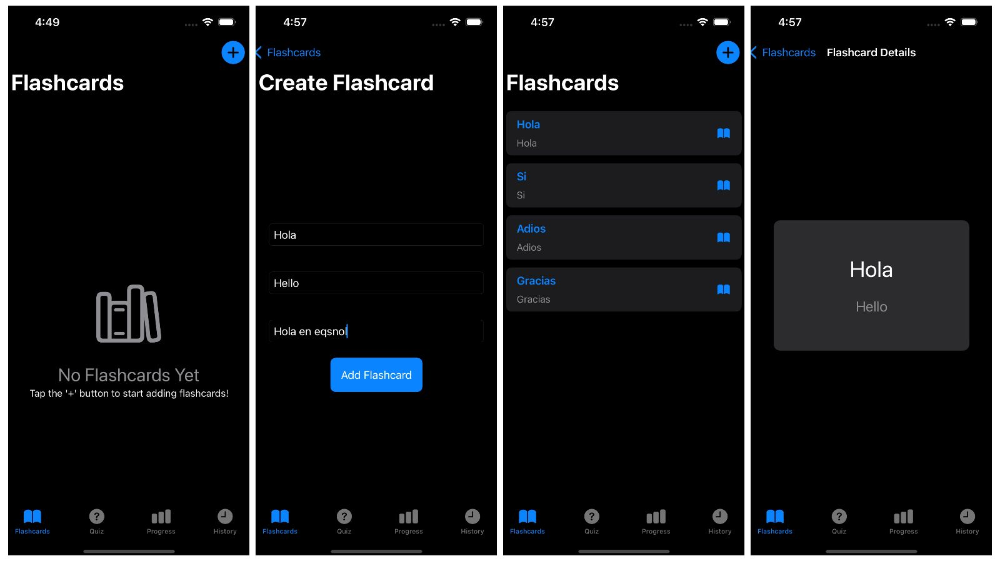
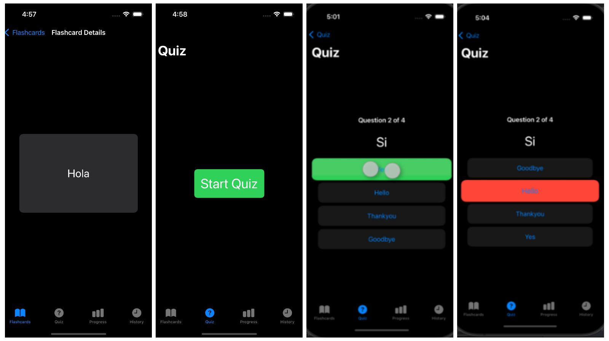
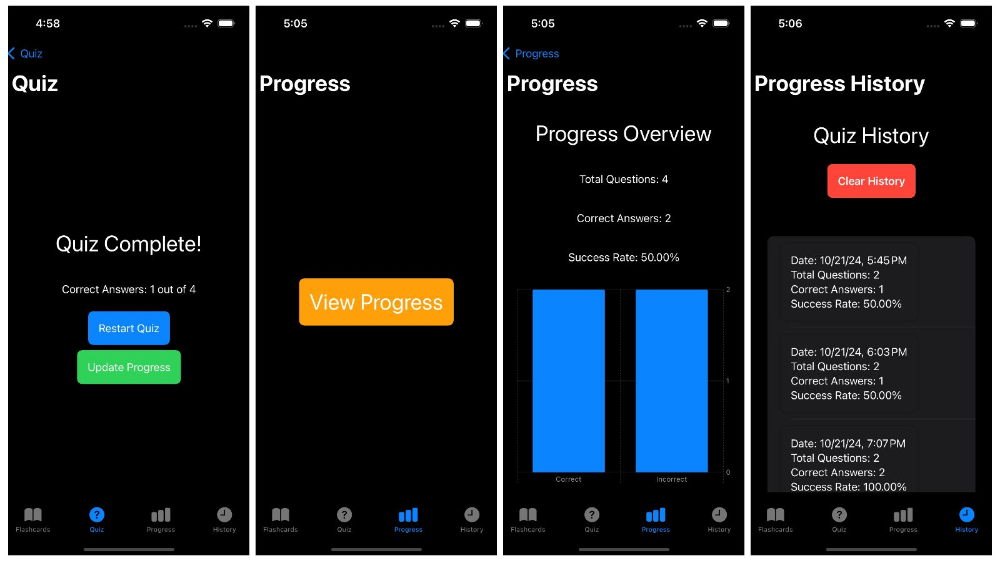

# Swift-Application-FlashcardApp

**Flashcards App**

A flashcard app built with SwiftUI, designed to help users practice and memorize new words or concepts with a quiz mode and spaced repetition feature. The app includes a progress tracking feature, animated flashcard flipping, and a history of quiz attempts.

**Features**

1. **Flashcards:** Create, edit, and delete flashcards for memorization. Each flashcard contains a word, its translation, and an example sentence.
2. **Flashcard Flipping Animation:** Interactive card flipping animations allow users to view the word, translation, and example sentence.
3. **Quiz Mode:** Test your knowledge with a quiz based on the flashcards you’ve created.
4. **Progress Tracking:** View your quiz progress with success rates and number of correct answers.
5. **Quiz History:** Track your past quiz attempts, including dates, total questions, and success rate.
6. **Dark Mode Support:** The app fully supports dark mode, providing a seamless experience regardless of the device's theme.

## Screenshots

### Flashcards List View

### Quiz View

### Progress History

**Installation**

1. Clone this repository to your local machine.

   git clone https://github.com/your-username/flashcards-app.git
3. Open the project in Xcode.
4. Build and run the app on a simulator or device.

# **How to Use**

1. **Flashcards:** Start by creating new flashcards by tapping the "+" button in the Flashcards tab.
2. **Quiz Mode:** Go to the Quiz tab to test your knowledge on the flashcards.
3. **Progress Tracking:** View your quiz results and see your success rate on the Progress tab.
4. **Quiz History:** Go to the History tab to view a list of your past quiz attempts, with details on each attempt.
5. **Clear History:** Press the "Clear History" button to remove all past quiz data.

# **Requirements**

  - Xcode 12 or later

  - iOS 14.0 or later

  - Swift 5.0

# **Technologies Used**

- **SwiftUI:** For building the user interface.

- **Core Data:** For storing flashcards and progress data locally.

- **Animations:** For creating smooth flashcard flipping effects.

# **Future Improvements**

- Add additional quiz modes for advanced learning.

- Include spaced repetition algorithms for smarter study sessions.

- Enable syncing of flashcards across devices using iCloud.

# **License**

- This project is licensed under the MIT License. See the LICENSE file for details.

# Contributing

- Feel free to open issues or submit pull requests to improve this project.
